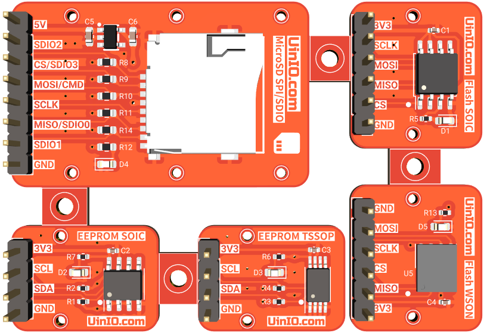
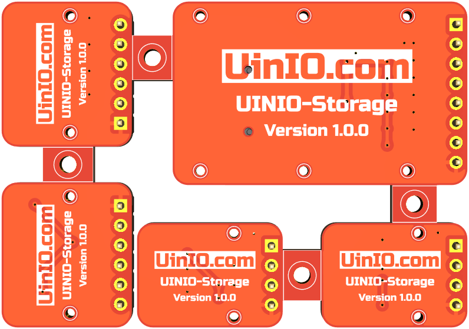

# UINIO-Storage 低速存储器模组

[**UINIO-Storage**](https://gitee.com/uinika/UINIO-Storage) 是一款同时支持 **EEPROM**、**Flash**、**MicroSD** 三种类型存储器的多功能模组，采用了拼板设计，每一片模组都添加有独立的 `1mm` 直径固定螺丝孔，可以单独拆分进行使用。

## 应用介绍

1. **EEPROM 存储器** `AT24Cxxx`：支持 SOIC 和 TSSOP 两种封装形式，使用 I²C 总线通信。
2. **Flash 存储器** `W25Qxxx`：支持 SOIC 和 WSON 两种封装形式，使用 SPI 总线通信。
3. **MicroSD 读卡器**：同时支持 `SPI` 和 `SDIO` 两种通信方式，独立 `5V` 线性稳压芯片供电，支持读写大容量 TF 卡。

> **注意**： 针对每个模组都进行了单独的分区覆铜，其中两片 AT24Cxxx EEPROM 模组分别被配置为不同的 I²C 地址。

## 设计概要

1. 每一片模组都单独添加有 `1mm` 直径的固定螺丝孔；
2. 每一片模组的 `3.3V` 外部供电端都添加了 `0.1uF` 滤波电容；
3. 已经为 **EEPROM** 存储器的 I²C 总线添加了 `10KΩ` 的上拉电阻；
4. 为了提升 **MicroSD 读卡器** 在读取大容量存储卡时的电流驱动能力，单独添加了一枚 `3.3V` 线性稳压芯片进行供电；
5. 配合**串行协议转换器** [UINIO-USB-Serial](https://gitee.com/uinika/UINIO-USB-Serial) 以及相应的上位机程序，可以方便的对模组上的存储器进行读写操作；

## 参考技术文档

[UinIO.com 电子技术实验室](http://uinio.com/) 为 UINIO-Storage 开源项目提供了如下一系列技术参考资料：

- [《BOM 交互式物料清单与 PCB 布线在线预览》](http://uinio.com/archives/BOM/UINIO-Storage.html)
