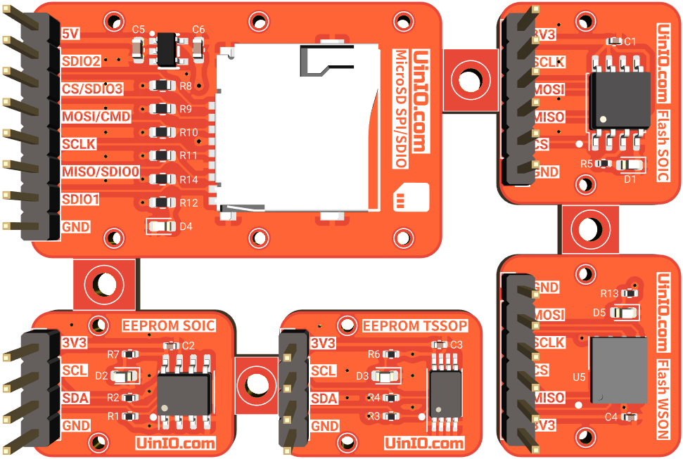
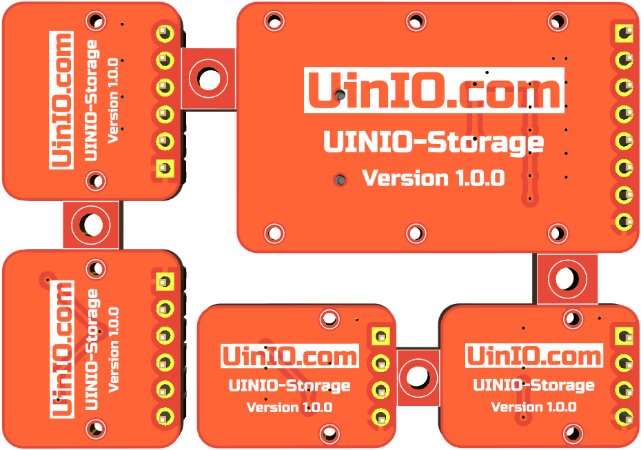

# UINIO-Storage 存储器模组

[**UINIO-Storage**](https://github.com/uinika/UINIO-Storage) 是一款同时支持 **EEPROM**、**Flash**、**MicroSD** 三种类型存储器的多功能模组，采用了拼板设计，每一片模组都添加有独立的 `1mm` 直径固定螺丝孔，可以单独拆分进行使用。

- **EEPROM 存储器** `AT24Cxxx`：支持 SOIC 和 TSSOP 两种封装形式，使用 I2C 总线通信。
- **Flash 存储器** `W25Qxxx`：支持 SOIC 和 WSON 两种封装形式，使用 SPI 总线通信。
- **MicroSD 读卡器**：同时支持 SPI 和 SDIO 两种通信方式，独立 `5V` 线性稳压芯片供电，支持读写大容量 TF 卡。

